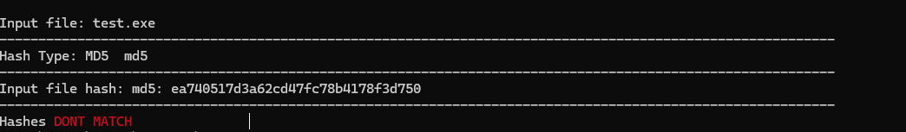

# 🛡️ chkhash

*chkhash* is a lightweight and speedy Go-based tool for checking and confirming file hashes. Made for verifying downloads or ensuring file integrity. (It was largely made just for fun!)

---

## 🚀 Features

* ✅ Quick hash checking
* 🔐 Supports **MD5** and **SHA256**
* 🧪 Compare against known hash values
* 📁 Minimal dependencies, easy to build

---

## 📸 Example Output

> *Below are examples of how it looks in action.*

### ✔️ Successful Match


### ❌ Hash Mismatch



---


## 🧩 Building

```bash
go build -o chkhash chkHash.go 
```

---

## 🛠️ Usage

```bash
chkhash -filename <your_file> -hashType <hash_algo> -cmpHash <expected_hash>
```

### ⚙️ Options

| Flag        | Description                                 | Default    |
| ----------- | ------------------------------------------- | ---------- |
| `-filename` | The file you want to check the hash of      | `test.exe` |
| `-hashType` | Type of hash to use (e.g., `md5`, `sha256`) | `md5`      |
| `-cmpHash`  | The hash you are comparing against          | `"NONE"`   |

---

## 🔧 Example Commands

```bash
# Check the MD5 of a file and compare it to a known hash
chkhash -filename test.exe -cmpHash ea740517d3a62cd47fc78b4178f3d750 -hashType md5
```

```bash
# Use SHA256 instead
chkhash -filename test.exe -hashType md5 e3b0c44298fc1c149afbf4c8996fb924...
```

---

## 💡 Pro Tips

* You can pipe output to a log file for auditing:

  ```bash
   chkhash ... > hash_log.txt
  ```
* Integrate with CI tools for automated integrity checks.

---


